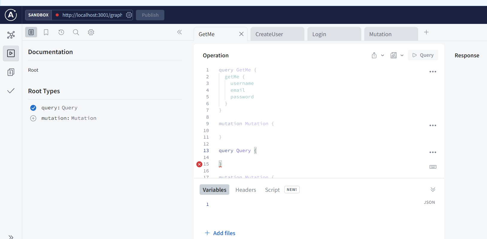

## Title

- MERN-Challenge-Book-Search-Engine

## Table of Contents

- [Summary](#Summary)
- [Technology Used](#Technolgy)
- [Links](#Links)
- [Installation & Database SetUp](#Installation)
- [License](#license)
- [Tests](#tests)
- [Questions](#questions)

## Summary

- Usage of Google Books API to create an Graql API with Apollo Server. MERN stack is implemented to create the app.
- User can sign up and log in for an account, search for a book of their liking and added to a list of saved books, users can also remove the saved books.
- User can search for new books to read, to keep list of books and to purchase favorite books.

## Technolgy Used

- JavaScript
- Node.js
- Express
- React
- Apollo Server
- Graphql
- Mongodb
- Mongoose

## Installation

- Install npm packages
- Run `npm run develop` on your terminal.
- OR use URL deployed application link on Links section.

## Tests

- All tested and passe
- 

## Links

- [URL of the functional deployed application](https://powerful-waters-09126.herokuapp.com/)
- [URL of the GetHub Repository](https://github.com/Tesfa8186/MERN-Book-Serach-Engine)

-
- 
- 

## License

